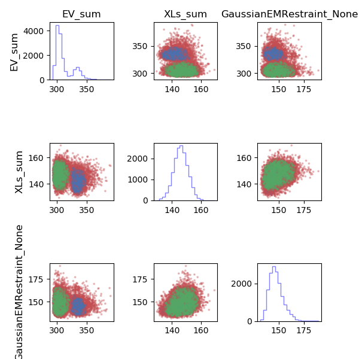

## The IMP analysis tutorial for RNA Polymerase III

Last updated: Nov. 2020

## Purpose

This tutorial walks the user through analyzing, validating and depositing integrative models produced by the Integrative Modeling Platform. 

## Running the tutorial.

The tutorial contains code to perform a complete integrative modeling pipeline from model building through archiving the models and protocols in mmCIF format.  Examples for a partially sampled and more extensively sampled protocols are provided. 

### 0. Installation
Install the tutorial and IMP as described in the [main page README](../README.md)

### 1. Building the RNA Polymerase III model, scoring function and sampling

This step is optional. One may skip directly to analysis (Step 2) using the provided output files

* Navigate to `./modeling`

* Change line 7 in `./run_rnapolii_modeling.sh` to point to your python installation

* run `./run_rnapolii_modeling.sh output_dir N n_steps`
  * `output_dir` is the prefix of the output directory
  * `N` is the number of independent sampling runs to do (at least 2, up to the number of processors you are willing to sacrifice) 
  * `n_steps` is the number of Monte-Carlo steps to run. 

Each 1000 steps takes a few to 20 minutes depending on your machine. The script will produce a significant amount of output to screen and create directories `output_dir0`, `output_dir1`, `...` which contain the output that will be analyzed. 

To sufficiently sample the system, at  `N>=4` and `n_steps>=50000` should be performed. Analysis can still be done on smaller samples. 

### 2. Score-based clustering

First, we do a quick assessment of the output for sampling mixing by clustering based on score values. 

* Navigate to `./analysis`
* run `python ./run_analysis_trajectories.py ../modeling/ output_dir`
  * `../modeling` is the path to the output directories
  * `output_dir` is the prefix of the output directories (same as above or `example` if you wish to analyze the supplied output. 
* Look at `model_analysis/plot_clustering_scores.png` (below)



Here, we see the plots for the `example` output with distinct, non-overlapping clusters of solutions.  This can be indicative of insufficient sampling. Models can still be analyzed, however it is likely that sampling precision will be able to be improved. The plot for more complete sampling, showing a single major cluster, can be seen in the `./analysis_extensive` results:


The results of score-based clustering are tabulated in `analysis/model_analysis/summary_hdbscan_clustering.dat`, which shows that cluster 1 is the largest and most diverse cluster (contains similar amounts of models in sample A and sample B).  We continue by analyzing this cluster.

Additional information about the satisfaction of restraints, including a detailed breakdown of crosslinking satisfaction by cluster are contained in `./model_analysis`.

### 3. Model extraction and computing sampling and model precision

We extract the coordinates from the models of cluster 1 using the following command:
```
python ./run_extract_models.py ../modeling example 1
```
Model coordinates (`A_models_clust1.rmf3` and `B_models_clust1.rmf3`) and model scores (`A_models_clust1.txt`, and `B_models_clust1.txt`) for the A and B subsets of cluster 1 are written to `./model_analysis`. 

The sampling precision of these models can then be computed as follows:
```
imp_sampcon exhaust -n rnapol \
--rmfA ./model_analysis/A_models_clust1.rmf3 \
--rmfB ./model_analysis/B_models_clust1.rmf3 \
--scoreA ./model_analysis/A_models_clust1.txt \ 
--scoreB ./model_analysis/B_models_clust1.txt \
-d density_rnapol.txt \
-m cpu_omp -c 4 \
-gp -g 2.0
```
Where:
* `-n` is the name of the system, used as the prefix for all output files
* `--rmfA`/`B` are the rmf files computed above
* `--scoreA`/`B` are the score files computed above
* `-d` is the name of the file containing the [localization density definitions](#Localization-density-file)
* `-m` is the computation mode: `cpu_omp`, `cpu_serial`, `cuda`
* `-c` specifies the number of cores when `-m` = `cpu_omp`
* -gp uses gnuplot to create output graphs of convergence statistics
* -g is the grid size for computing sampling precision. Larger values are faster, however are less precise.

The sampling precision for cluster 1 of the `example` data is reported as 12.6 angstroms in `rnapol.Sampling_Precision_Stats.txt`. The result of the three statistical tests for sampling covergence are plotted in `rnapol.ChiSquare.pdf`

The script will cluster the models at the estimated sampling precision. The centroid and localization densities for these cluster are output into `cluster.0`, `cluster.1`, etc...

### 4. Computing model precision and its comparison to sampling precision

The model precision for each cluster is found in `rnapol.Cluster_Precision.txt`. We find here that our cluster precision is 8.615 angstroms.

Cluster precision is defined as the weighted average RMSD between each configuration in the cluster and the cluster centroid (or RMSF). Since our sampling precision is computed as an RMSD, to compare our model and sample precision, we multiply by the general relationship between RMSD and RMSF for globular systems (RMSD = 1.4 * RMSF). Our cluster precision of 8.6 $\mathring A$ * 1.4 = 12.1 $\mathring A$, then, is comparable to our sampling precision of 12.6 $\mathring A$. This indicates that our sampling is sufficient to resolve features at the resolution of this model cluster.

Localization densities can be viewed in [ChimeraX](https://www.cgl.ucsf.edu/chimerax/download.html) as well as RMF files with the associated [plugin](https://cxtoolshed.rbvi.ucsf.edu/apps/chimeraxrmf) for viewing RMF files. 

### 4. Archiving and depositing integrative structures

Finally, the protocols and models produced from integrative modeling should be archived and deposited in the public domain so that others may build upon the protocols by adding information, sampling, new representations or scoring functions. 

Navigate to `./ihm_deposition` and follow the [README](./ihm_deposition/README.md).

### Localization density file
The file `density_rnapol.txt` contains sets of model components used to compute localization densities. Each entry in the `{}` bracketed dictionary represents a localization density that is produced during the clustering analysis. Each entry is named in quotes, i.e., `"Rbp4"` and assigned a list of components in `[]` brackets. Each component is defined by the molecule name defined in the modeling step, i.e., `"Rbp7"`. Specific residues from a molecule can be defined in a `()` bracket, e.g., `("Rbp4", 1, 25)`, which defines residues 1-25 in molecule Rbp4. 

For this example, we place each moving subunit into its own localization density and the balance of the complex in the fixed `"Rigid_Body` complex.

```
density_custom_ranges={"Rbp4":["Rbp4"],"Rbp7":["Rbp7"], "Rigid_Body":["Rbp1", "Rbp2", "Rbp3", "Rbp5", "Rbp6", "Rbp8", "Rbp9","Rbp10","Rbp11","Rbp12"]}
```


